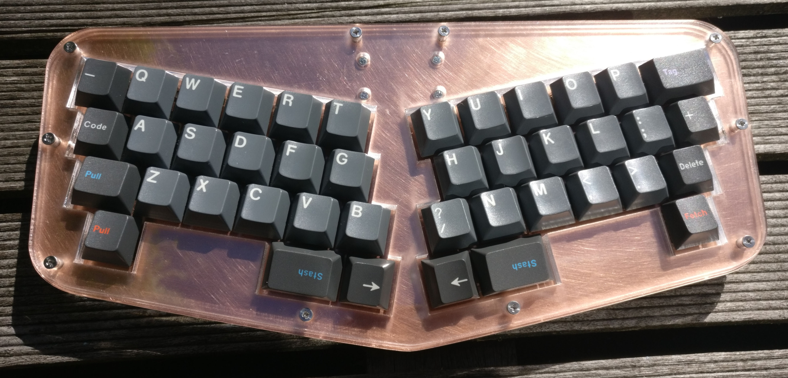
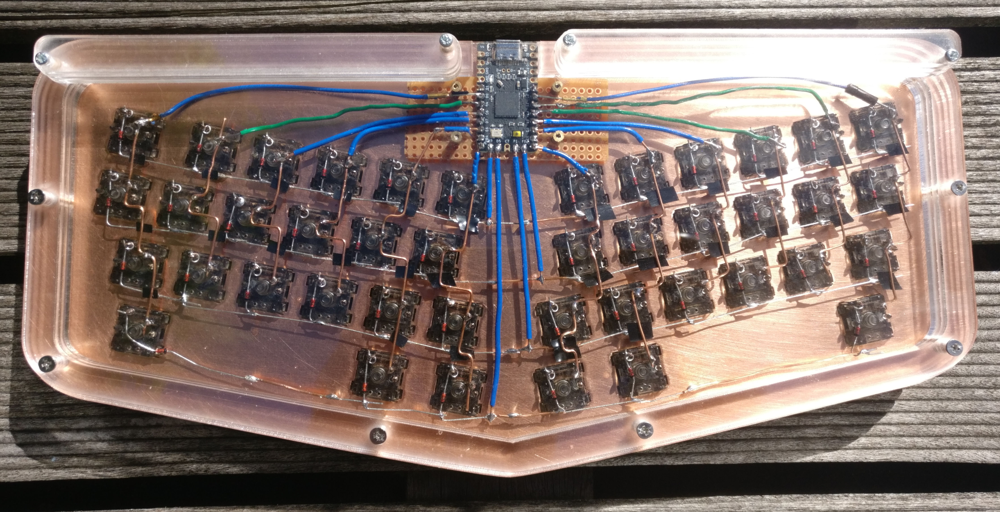

# Eliza

On of those ergo in one piece layouts.
They tend to have short feminine names such as `Alice` and `Elise`.
The layout was inspired by the `Prime Elise` keyboard which is a very cute 40 percent layout.
I named mine after the Elise but I dutch-ified it.
- 42 key layout
- stabless
  - you press a key at a certain sweetspot which isn't that big
  - if a key is big enough for a stab it's wasting space: you will never hit outside the small sweetspot
  - stabs are a pain in the ass
    - extra cost
    - extra complication in plate
    - extra time spend on tuning
    - extra maintainace: can unlube themselves and start rattling, lube gets dirty
      - can unlube themselves and start rattling
      - lube gets dirty
      - lube spreads through the keyboard
- 11.25 degree split
  - First it was 15 degrees but after seeing some Alice style layouts having 6 and 7 degree angles i deradicalized to 11.25
  - After typing on it, 11.25 seems fine and not too much, don't know why other boards keep such a low angle




[sound test on youtube](https://youtu.be/kfLyLSXiLqk)

## Disclaimer

This is is my first project of this kind. The design is not flawless.
I did need some "work" for the parts to fit together.
The files are as I used them to build my board.
Build/use/adapt at your own risk.

## Stacked acrylic build plan

- M2 standoff mounting:
  - M2x20mm 3.5mm outer diameter round standoffs
  - M2 flat top scews, 5mm long, 5mm wide(top)
- Elite-c v4 usb-c controller
- handwired
- Layers: plate (metal), bottom, top, open, closed (acrylic)
- 21.5mm:
  - 8mm to edge of keycaps
    - 2mm top
    - 3mm top x 2
  - 1.5mm plate
  - 9mm space on bottom (3 x 3mm open layer)
  - 3mm base layer

## Some measurements
- Elite C dimensions: 19mm x 35mm x 5mm
- Plate switches selection: 247.498mm x 102.721mm at 26.947, 29.393
- Top at 23.945, 26.208 which is relative to switches selection at: -3.002, -3.185
- Stroke: 0.189mm (plate)
- 976 gr: (6 x 3mm + 2mm) x (29 cm x 14 cm) perspex clear pmma + foil + stickers
- Laserboost cut plate: 320 gr
- Fully build weight: 786 gr

## Some notes

- swillkb params:
  - mount holes: 10, 3.5, 15
  - edge padding: 20
  - plate corners: 5
  - kerf: 0.15
- Budget lasers brm lasers: 46x26 cm workspace, takes DXF R14 via RDWorks
- RDWorks import cannot handle primitives(wrong scale), convert all primitives to paths
- RDWorks has wrong uniform scale, need to go in inkscape to see how big your objects are and set it in RDWorks
- RDWorks is a sad piece of software that freaks out if you enter a floating point number that doesn't have 3 digits after the dot
- RDWorks UI is ugly and crap(windows 98 looking mf)
- Laser cutter did some random things wrong:
  - little indentation that doesn't exist in file
  - A whole wrong part that never existed, looks like a weird combination of files

## Things that are scuffed

- The plate and the acrylic mounting holes didn't quite line up and I drilled out the plate
- The laser cutting didn't cut through each layer all the way through and breaking them out left some
scuffed edges on some layers
- My switch lubing consistency is not optimal
- My hand finish on the plate is scuffed
- Keeping finger prints that oxidize off the plate is hard, I gave up on the backside...
- One of the standoff's finish has been scuffed by gripping it with pliers
- The top layer switches cutout could be better:
  - The gap is inconsistent
  - the gap could be smaller
- Plan was to have a solid wire manhatten style handwire
  - Rows are just diode legs
  - Columns are only manhatten-ish-inspired
- Plan was to stick on some feet but i couldn't be arsed
  - It sits on a deskmat anyway
  - Front left and right corners float a bit, but this gives a subtle "flex" feeling on keys at the edges and is fine
  - Dragging the little monster might scratch your deskmat a bit with the screws
- I cracked the acrylic by overtightening the screws
- The plate is not quite tight enough in places, I pulled a cap off but the switch came out a bit and broke the handwire
- The handwire has small pieces of tape on the crossing of rows and columns so it doesn't short. One of them might just fall out any moment and ruin the matrix, especially if you transport the keyboard.
- I tried to clean the plate with alcohol but it left some spots when it dried up and I thought I could just get that off again but it's just really in there now and I don't know why

## Things that are nice

- I sounds good, without any foam or tape bullshit going on
- The layout turned out well
- It has no stabs (I hate stabs I hate stabs I hate stabs)
- Handwire is cool even my shitty one
- Even though it has visible scuffs and cracks it still looks pretty good
- GMK caps are always nice
- Those gat inks are smooth
- It's my baby that I designed and build
- My cat(Kiwi) loves it too she always all over it when I try to use it at night

## Costs including shipping, tax, import in EUR (for me personally)

Total: 7.22 + 30.52 + 105.16 + 99.11 = 242.01
- Hardware: 5.94 + 1.28 = 7.22
  - 10 Gold coloured aluminium standoff: M2x20mm, OD: 3.5mm =  5.94
  - 25 M2 stainless steel cross philips flat wafer head screw: 3mm long, 5mm wide = 1.28
- Electronics: 30.52
  - Elite-C v4
  - 50 through hole diodes
  - unused M2 bits
  - Wiring: 0 (some random wires)
- Caps, Switches: 45.62 + 31.50 + 10.08 + 17.96 = 105.16
  - GMK Oblivion V3.1 ASCII: 37.62 cost + 8 shipping = 45.62 (of which 7.92 is tax)
  - GMK Oblivion V2 Git: 0 (used some caps from left overs of in-use set)
  - Switches: Gateron Ink Black V2 10 x 5 = 31.50
  - Springs: Tx Springs L 16mm 62gr = 10.08
  - Tax + Shipping (Switches + Springs + Washers + ...) = 12.08 tax + 5.88 shipping = 17.96
  - Tribosys 3204: 0 (i used leftovers from previous build)
  - Kebo switch films: 0 (i used leftovers from previous build)
- Construction: 61.72 + 37.39 = 99.11
  - Copper plate: 30.87 cost + 20.14 shipping + 10.71 tax = 61.72
  - Acrylic: 15 cost + 15.90 shipping + 6.49 tax = 37.39

Lesson learned: when building things like this from scratch you need to order many separate items.
All these are going to have shipping included even if it's just a silly small thing.
Shipping can be more costly than the item itself on many occasions.
I hoped it would be cheaper to build something like this.
I even used some items I already had left over from a previous build reducing the cost.

## handy links

- http://www.keyboard-layout-editor.com/#/
- https://kbplate.ai03.com/
- https://plate.keeb.io/
- http://builder.swillkb.com
- https://kbfirmware.com/
- https://deskthority.net/wiki/Elite-C

## License

```
Copyright (C) 2023 Cody Bloemhard

This program is free software: you can redistribute it and/or modify
it under the terms of the GNU General Public License as published by
the Free Software Foundation, either version 3 of the License, or
(at your option) any later version.

This program is distributed in the hope that it will be useful,
but WITHOUT ANY WARRANTY; without even the implied warranty of
MERCHANTABILITY or FITNESS FOR A PARTICULAR PURPOSE.  See the
GNU General Public License for more details.

You should have received a copy of the GNU General Public License
along with this program.  If not, see <https://www.gnu.org/licenses/>.
```
